# Project 7: AI Inference Platform on GKE

I built this to serve an open-source LLM (vLLM with Qwen2.5-1.5B-Instruct) on GKE and to answer one question with tests instead of configuration files: how do I know that what is running is what I meant to run? The signed image pipeline, admission control, GitOps, network policy and cost attribution around the model all exist to answer it.

**Status:** Built and validated on CPU inference. GPU inference never ran: a project-level GCP quota (`GPUS_ALL_REGIONS = 0.0`) blocked every GPU node I tried, across four GPU types, five regions and a fresh project ([investigation](docs/adr/gpu-provisioning-blocker.md)). Nothing here claims GPU performance, real users or production traffic. It is a dev project on free-trial credit, and every number below comes from a recorded run.

**The gap that matters most:** as the manifests stand, neither deployment runs the image this pipeline builds and signs. The CPU deployment pulls a public ECR image and the GPU one a Docker Hub image. The signing and admission controls are proven on the pipeline's own image, not yet on the workload that serves traffic. Details under [Security](#security).

---

## Engineering Problem

A hosted model API leaves most operational questions with the vendor. Self-hosting hands them to me: who may change what runs, how I know an image is the one I built, what can talk to the model, how long a restart takes, and what all of it costs. Getting one completion out of vLLM is the easy part. The hard part is keeping those answers true while images, nodes and people change underneath it.

---

## Architecture

```
git push
  |
  v
GitHub Actions --- Workload Identity Federation (OIDC, no keys) ---> GCP
  |  build image (app/Dockerfile)
  |  push to Artifact Registry
  |  Trivy scan, fail on CRITICAL
  |  Syft SBOM (SPDX JSON, kept as a build artifact)
  |  Cosign sign
  v
Artifact Registry   us-central1-docker.pkg.dev/velrite-tf-test/project7-inference

Argo CD (watches this repo, top level of k8s/)
  |
  v
GKE project7-cluster, us-central1-a
  |-- Kyverno verifyImages: pods from the registry path above must carry my Cosign signature
  |-- NetworkPolicy: default-deny plus one explicit allow
  |-- vLLM pod on cpu-inference-pool --> Service :8000 --> Ingress (rate and size limits)
  `-- OpenCost + Prometheus: per-namespace cost
```

| Piece | Notes |
| --- | --- |
| vLLM | Qwen2.5-1.5B-Instruct, bfloat16, `--enforce-eager`, `VLLM_ENABLE_V1_MULTIPROCESSING=0`. Requests 2.5 CPU / 8 GiB, limits 3.5 CPU / 12 GiB. The startup probe allows 15 minutes because model load is slow on CPU. |
| Node pools | `system-pool` (e2-standard-2), `cpu-inference-pool` (e2-standard-4, 60 GB, 0 to 1 node), `gpu-pool` (n1-standard-4 with one V100, 0 to 1 node, sits at zero). Inference has its own pool so platform tooling never competes with the model. |
| Identities | Three separate service accounts: nodes (logs, metrics, image pull), CI (registry writer), app (Secret Manager reader). Nodes and workloads never share one. |

| Layer | What is used |
| --- | --- |
| Infrastructure | Terraform with GCS state, custom VPC with explicit pod and service ranges, zonal GKE, Artifact Registry |
| Delivery | GitHub Actions with Workload Identity Federation, Argo CD (automated sync, prune and self-heal off) |
| Supply chain | Trivy (fail on CRITICAL), Syft SBOM, Cosign signing, Kyverno `verifyImages` |
| Identity | WIF for CI, Workload Identity plus Secret Manager for pods |
| Network | NetworkPolicy default-deny with one explicit allow, NGINX ingress with rate and request-size limits |
| Observability | GKE Managed Prometheus `PodMonitoring` on vLLM, OpenCost with a self-hosted Prometheus |

---

## The Failure That Shaped the Platform: The Quota Page Said Yes

**Symptom.** The GPU node pool existed in Terraform, but no GPU node ever came up.

**What looked fine.** The per-GPU quota for V100 in us-central1 showed a limit of 1.0 ([screenshot 06](docs/10-evidence/06-gpu-quota-zero.png)), and zone stock was available.

**Root cause.** The managed instance group's error log said `Quota 'GPUS_ALL_REGIONS' exceeded. Limit: 0.0 globally.` That is a project-wide ceiling that overrides every per-type quota. A brand-new project under the same billing account hit the identical wall, so it is tied to the account, not a project or region.

**What I did.** I ruled out L4, T4, P100 and V100 and five regions. The console refused the quota increase and Support redirected me to manual review, so I escalated with the evidence and kept building everything that did not need a GPU. The CPU path reuses the same vLLM stack, so the pivot was configuration, not a rewrite.

---

## Reliability Evidence

| Scenario | Outcome | Evidence |
| --- | --- | --- |
| Pod killed while healthy | Replacement scheduled automatically and Running within seconds, but Ready only after the model reloaded (several minutes). My first check failed because I asked too early | [pod-kill-and-load-test.md](docs/07-reliability/pod-kill-and-load-test.md) |
| Cold start | Five sequential requests: two timed out at 60 s, then 43.8 s, 9.7 s, 9.3 s. A one-time warm-up, then about 9 to 10 s for a ~20-token completion on CPU | same |
| Concurrent requests (1, 3, 5) | Run and written up | [concurrent-load-test.md](docs/07-reliability/concurrent-load-test.md) |
| Broken image tag through GitOps | The broken rollout could not displace the healthy pod because the CPU pool is capped at one node. Recorded as a finding | [rollback.md](docs/04-delivery/rollback.md), [gitops-evidence.md](docs/gitops-evidence.md) |
| Signed image admitted | CI-signed image `a715ccb...` created with no denial | [screenshot 10](docs/10-evidence/10-kyverno-signature-enforcement.png) |
| In-scope image that does not exist | Rejected at admission (manifest unknown) | [screenshot 10](docs/10-evidence/10-kyverno-signature-enforcement.png) |
| Same commit in three systems | `git rev-parse HEAD`, the signed registry tag and Argo CD's synced revision all show `a715ccbdd1da4c07dcd814bc21e0569c623280ee` | [screenshot 14](docs/10-evidence/14-chain-of-custody.png), [11](docs/10-evidence/11-argocd-gitops-sync.png) |
| Pod outside the allowed label | Blocked by default-deny | [screenshot 04](docs/10-evidence/04-network-policy-objects.png), [12](docs/10-evidence/12-networkpolicy-enforcement-test.png) |
| Secrets without keys | Pod with the bound service account read the test secret, an unbound pod could not | [secrets-management.md](docs/05-security/secrets-management.md) |
| Destroy and rebuild | Identity pool soft-delete recovered, docs restored from git history | [screenshot 03](docs/10-evidence/03-workload-identity-federation.png), [08](docs/10-evidence/08-docs-recovery-history.png) |

---

## Failure Catalogue

**CI red on every recent run.** Two new CRITICAL CVEs in `linux-libc-dev` (CVE-2026-63940, CVE-2026-74394) failed the Trivy step before the SBOM or signing ran. They are kernel headers this workload never uses, the same pattern as the four exceptions already in `.trivyignore`, so I added them with that justification. The next run went green in 14 m 45 s ([screenshot 09](docs/10-evidence/09-ci-pipeline-success.png), [13](docs/10-evidence/13-sbom-artifact.png)). One side effect: the pipeline pushes the image before it scans, so every failed run left a pushed, unsigned image in the registry.

**My first Kyverno tests proved nothing.** I used `nginx:latest`, which is outside the policy's `imageReferences`, so it was allowed, correctly. My second attempt at the allow case used a tag I had made up, and it was denied because the manifest did not exist. The valid pair is a real CI-signed tag (admitted) and an in-scope tag that does not exist (denied).

**Kyverno can fail closed without checking anything.** To verify a signature Kyverno has to pull the image. Without its own Workload Identity binding and `artifactregistry.reader`, verification fails closed and denies everything, which looks like security working but verifies nothing. Node-level IAM does not flow to pods, so the binding has to be on Kyverno's own service account.

**Soft-deleted identity pool.** After `terraform destroy`, the Workload Identity pool and provider sit in GCP's soft-delete state and `terraform apply` returns a 409. Recovery is `gcloud iam workload-identity-pools undelete` then `terraform import`. `scripts/startup.sh` now does both.

**Argo CD scope.** The first sync deployed the abandoned GPU manifest next to the real CPU one, and it sat Pending forever because the GPU pool is at zero. It is now excluded. Argo CD also syncs only the top level of `k8s/` (no `directory.recurse`): the first sync listed four resources, all top-level files, so the subfolders are applied by `startup.sh`. The ApplicationSet CRD was too large for a plain `kubectl apply`; it needs `--server-side`.

**Wrong cluster.** This account also holds `atlas-dev` and a Forge Autopilot cluster. A stale kubectl context has sent this project's manifests to Forge, where Autopilot rejected the `pool` node selector. I deleted what had landed. `startup.sh` now checks the context twice and stops on a mismatch.

**CPU startup deadlock.** vLLM's V1 multiprocessing hung on CPU with no crash and no error. `VLLM_ENABLE_V1_MULTIPROCESSING=0` with `--enforce-eager` fixed it ([commit 015b825](https://github.com/velrite/project7-ai-inference-platform/commit/015b82581ebc417ca2047062333749870992db9c)).

**Node sizing.** A system node hit DiskPressure and insufficient memory, and an SSD quota limited node replacement. The inference pool is sized from those incidents ([architecture decisions](docs/02-architecture/architecture-decisions.md)).

**NetworkPolicy objects existed before they were enforced.** The gap and the fix are in [incident-calico-enforcement.md](docs/incident-calico-enforcement.md).

**Documentation loss.** I deleted and rewrote the docs, then lost the working terminal session. The 40 files came back with `git checkout fad15a7^ -- docs/` (commit a4c9ef5), because deleting a file does not remove it from history ([screenshot 08](docs/10-evidence/08-docs-recovery-history.png)).

---

## Delivery Path and Identity

```
commit
  |
  v
GitHub Actions: build, push, Trivy, Syft SBOM, Cosign sign
  |
  v
Argo CD syncs the top level of k8s/ from master
  |
  v
Kyverno checks the signature before any pod from the registry path is admitted
```

An organization policy blocks service-account key creation, so no static GCP credential exists in this project. CI authenticates with short-lived OIDC tokens through Workload Identity Federation. The provider's `attribute_condition` restricts it to this one repository; without that line, trust would be much broader than intended. The Cosign private key lives only in GitHub secrets, and only `cosign.pub` is committed.

---

## Cost

Real usage cost for Aug 1 to 19 was $27.50, fully offset by free-trial credit, plus a one-time $10 charge to reactivate the billing account ([cost-per-inference.md](docs/08-finops/cost-per-inference.md)). The $1.83 per request in that document divides fixed cluster cost by about 15 test requests. It demonstrates the method and is not a unit cost.

Per-namespace attribution from OpenCost, using real GCP list prices over a 6.9 hour window (2026-09-15 11:25 to 18:18 UTC, [screenshot 07](docs/10-evidence/07-opencost-allocation.png)):

| Namespace | CPU | RAM | Total |
| --- | --- | --- | --- |
| `default` (vLLM) | $0.54503 | $0.23377 | $0.7788 |
| `kube-system` | $0.44518 | $0.05498 | $0.50016 |
| `gke-managed-cim` | $0.02289 | $0.00371 | $0.0266 |
| `opencost` | $0.00431 | $0.0031 | $0.00741 |
| `gmp-system` | $0.0024 | $0.00239 | $0.00479 |
| `prometheus-system` | $0 | $0 | $0 |
| **Total** | | | **$1.31776** |

Two things the data showed. The vLLM pod averaged 0.009 CPU cores against a 2.5 core request (0.35% efficiency) because it sat idle between tests. Memory is the opposite: it averaged about 9.1 GiB against an 8 GiB request. That is under its 12 GiB limit but over its request, so the request is too low and the pod is exposed to eviction under node memory pressure. `prometheus-system` shows $0 because its Helm release sets no resource requests, not because it is free; it used about 364 MB. The first 14-minute pull is in [docs/finops.md](docs/finops.md).

---

## Security

Implemented: Workload Identity Federation for CI with the provider locked to this repository, separate least-privilege service accounts for nodes, CI and the app, Secret Manager read through Workload Identity (proven with bound and unbound test pods), Trivy plus Syft plus Cosign in CI, Kyverno `verifyImages` in `Enforce` mode, NetworkPolicy default-deny, ingress rate and request-size limits ([evidence](docs/ingress-protection-evidence.md)), and a model-artifact integrity script with pass, fail and tamper-detection tests.

Gaps, stated plainly:

- **The serving pod is outside the signature policy.** The CPU deployment runs `public.ecr.aws/q9t5s3a7/vllm-cpu-release-repo:latest`, a third-party image with a mutable tag, and the GPU manifest runs `vllm/vllm-openai:latest`. The image my pipeline builds and signs from `app/Dockerfile` is not referenced by either. The fix is to build the CPU image through the pipeline, pin it by digest and deploy from the registry.
- **The captured rejection is a failed lookup, not a missing signature.** A stricter test uses an image that exists but was never signed. Several do: CI pushes before it scans, so a run that failed the scan left one behind. I have not run that test.
- **No authentication in front of the inference endpoint.** The ingress limits request rate and size, nothing more.
- **Trivy fails only on CRITICAL.** HIGH findings in the vLLM base image are accepted risk ([security-exceptions.md](docs/security-exceptions.md)), and `.trivyignore` carries six `linux-libc-dev` exceptions.
- **Kyverno policy uses the deprecated `kyverno.io/v1` API.** `kubectl` warns about it on every apply.

---

## Production-Shaped, Not Production-Claimed

The practices here are the ones a production system needs: keyless CI identity, signed images, admission control, GitOps, default-deny networking, cost attribution, and failures written up instead of hidden. The system is not production. It has one replica, one environment, no autoscaling and no users. Multi-region, high availability and on-call are out of scope.

---

## Known Limitations

- No GPU inference has run, so no GPU latency or throughput exists. The CPU latency above must not be read as GPU performance.
- One replica and no autoscaler. Load tests are small, and TTFT and TPOT were not broken out in the pod-kill test.
- `PodMonitoring` scrapes vLLM metrics, but I built no dashboard and no alerts on top of it.
- Prometheus for OpenCost has no persistent volume, so cost history resets when its pod restarts.
- No centralized logging. I debug with `kubectl logs`.
- `scripts/startup.sh` was updated for Kyverno and Argo CD and has not been run end to end on a fresh cluster since.
- Single environment (`dev`). No staging.

---

## What Is Proven

| Area | State | Evidence |
| --- | --- | --- |
| Infrastructure, destroy and rebuild | Proven | [01](docs/10-evidence/01-cluster-and-node-pools.png), [03](docs/10-evidence/03-workload-identity-federation.png) |
| CI: build, scan, SBOM, sign | Proven, one green run | [09](docs/10-evidence/09-ci-pipeline-success.png), [13](docs/10-evidence/13-sbom-artifact.png) |
| Admission enforcement | Proven on the registry path. Does not cover the serving pod | [10](docs/10-evidence/10-kyverno-signature-enforcement.png), [14](docs/10-evidence/14-chain-of-custody.png) |
| GitOps | Proven for the top level of `k8s/` | [11](docs/10-evidence/11-argocd-gitops-sync.png) |
| Network segmentation | Proven | [04](docs/10-evidence/04-network-policy-objects.png), [12](docs/10-evidence/12-networkpolicy-enforcement-test.png) |
| Live inference on CPU | Proven | [05](docs/10-evidence/05-live-inference-response.png) |
| GPU inference | Blocked by account quota | [06](docs/10-evidence/06-gpu-quota-zero.png) |
| Cost attribution | Measured on a small sample | [07](docs/10-evidence/07-opencost-allocation.png) |

---

## Running It

`scripts/startup.sh` plans and waits for me to type `apply`, checks the kubectl context twice, recovers a soft-deleted identity pool, installs Kyverno and Argo CD, applies the manifests Argo CD does not manage, waits for the model to load and runs a real completion. `scripts/teardown.sh` pauses Argo CD sync, removes Kyverno's webhooks and prints the destroy plan. It never applies it.

```
cd terraform/environments/dev
terraform init
terraform plan
terraform apply
```

- Run Terraform from `terraform/environments/dev`, never the repo root.
- After apply the vLLM pod takes several minutes to become Ready. It is loading weights.
- Destroying deletes the Workload Identity pool CI depends on, and CI fails with `invalid_target` until the next apply.
- After a destroy, `gcloud container clusters list` and `gcloud compute instances list` should both return nothing.

## Documentation

- [docs/01-overview/](docs/01-overview/): problem statement, requirements, goals and non-goals
- [docs/02-architecture/](docs/02-architecture/): system design and decisions
- [docs/03-infrastructure/](docs/03-infrastructure/): compute, Kubernetes, IaC
- [docs/04-delivery/](docs/04-delivery/): CI/CD, deployment, rollback
- [docs/05-security/](docs/05-security/): threat model, identity, secrets, supply chain
- [docs/07-reliability/](docs/07-reliability/): failure modes, load tests, disaster recovery
- [docs/08-finops/](docs/08-finops/) and [docs/finops.md](docs/finops.md): cost model and real attribution
- [docs/09-operations/](docs/09-operations/): incident response, troubleshooting, runbooks
- [docs/adr/gpu-provisioning-blocker.md](docs/adr/gpu-provisioning-blocker.md): the GPU investigation
- [docs/runbooks/full-recovery.md](docs/runbooks/full-recovery.md): full environment recovery
- [docs/build-guide.md](docs/build-guide.md): long rebuild-from-scratch walkthrough with the source inlined. Read the corrections at the top first.

## Evidence

Screenshots captured against the running cluster.

<details>
<summary>Show all 15 screenshots</summary>

**01-cluster-and-node-pools**

[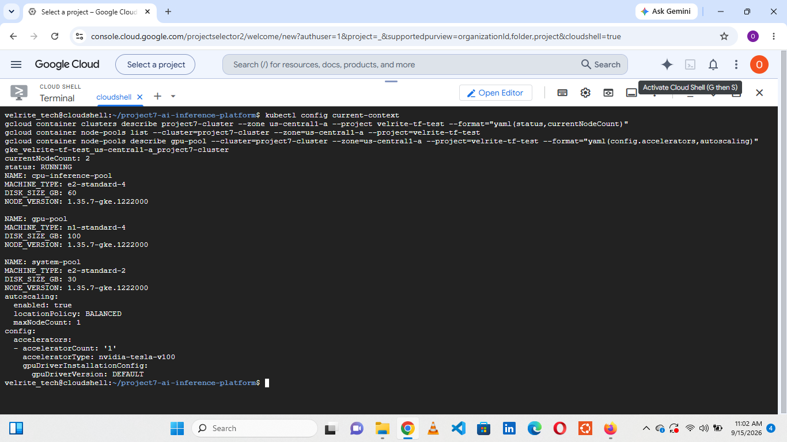](docs/10-evidence/01-cluster-and-node-pools.png)

**03-workload-identity-federation**

[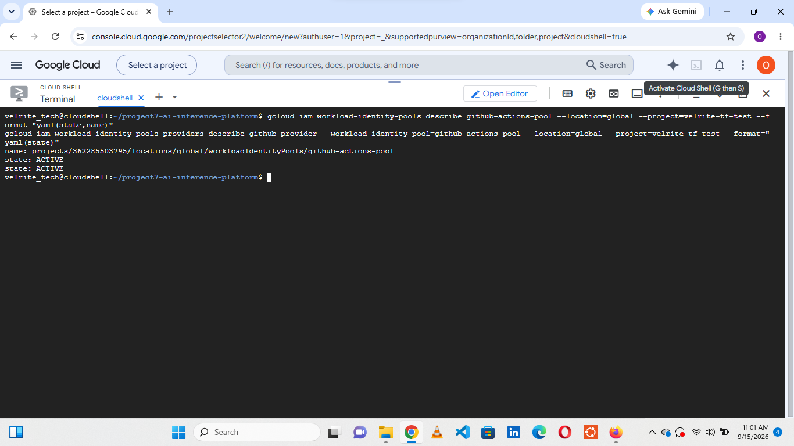](docs/10-evidence/03-workload-identity-federation.png)

**04-network-policy-objects**

[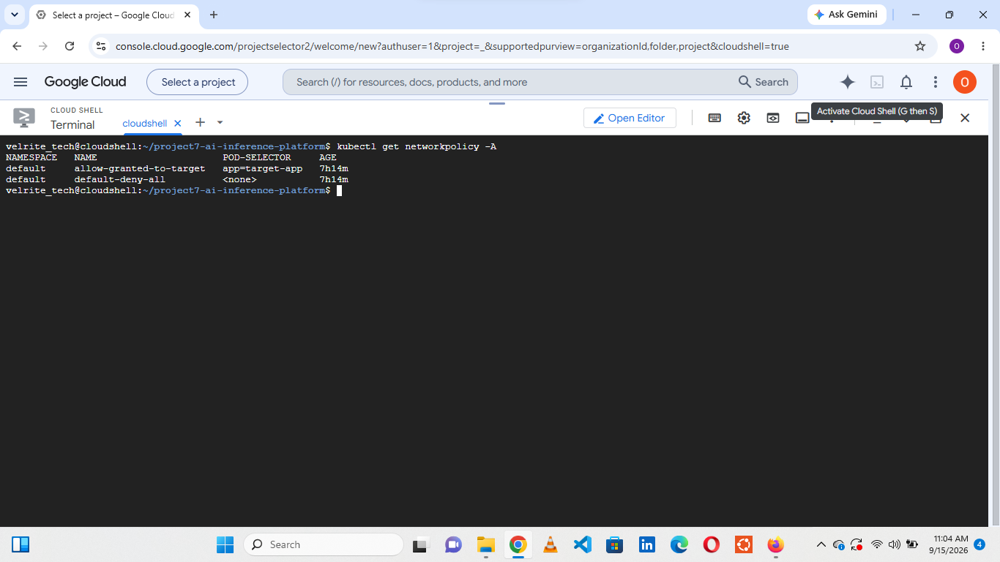](docs/10-evidence/04-network-policy-objects.png)

**05-live-inference-response**

[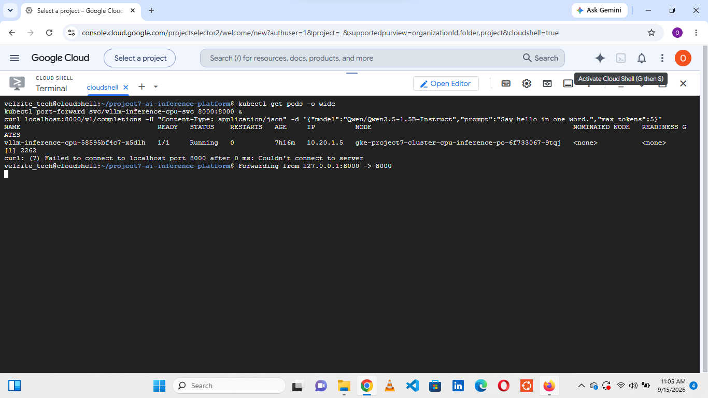](docs/10-evidence/05-live-inference-response.png)

**06-gpu-quota-zero**

[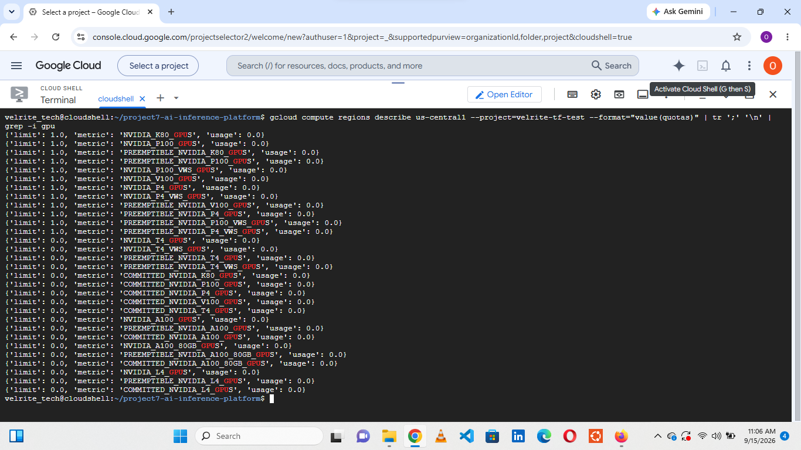](docs/10-evidence/06-gpu-quota-zero.png)

**07-opencost-allocation**

[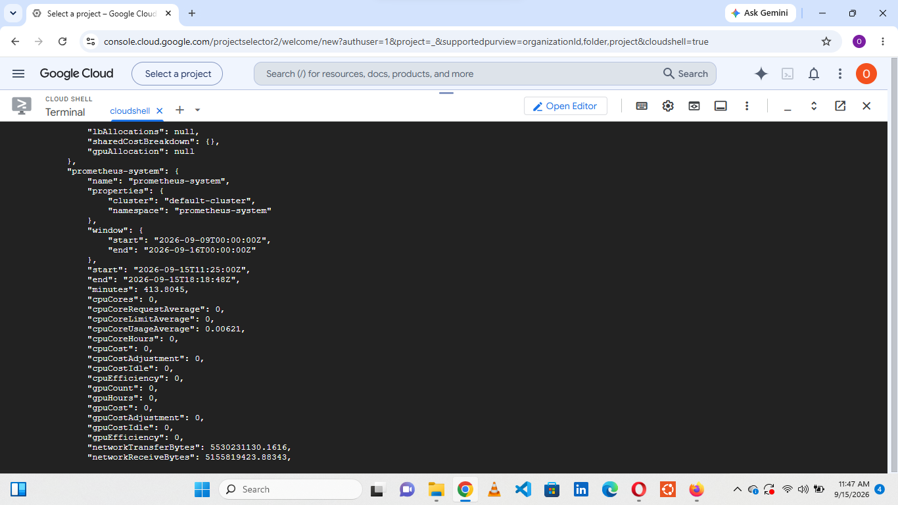](docs/10-evidence/07-opencost-allocation.png)

**08-docs-recovery-history**

[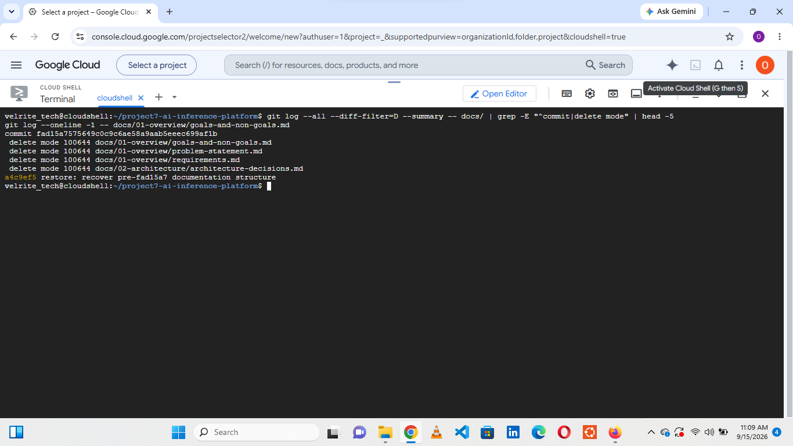](docs/10-evidence/08-docs-recovery-history.png)

**09-ci-pipeline-success**

[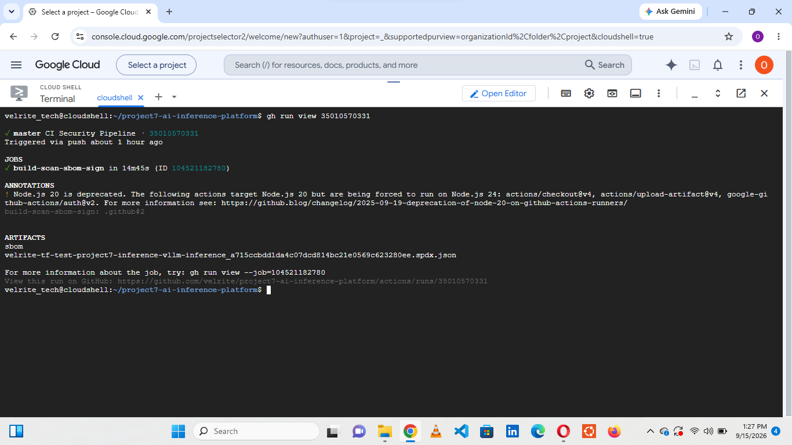](docs/10-evidence/09-ci-pipeline-success.png)

**09-ci2-pipeline-success**

[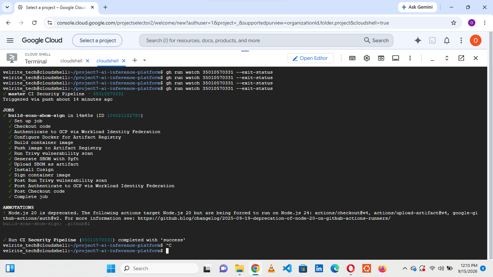](docs/10-evidence/09-ci2-pipeline-success.png)

**09-zero-cost-teardown**

[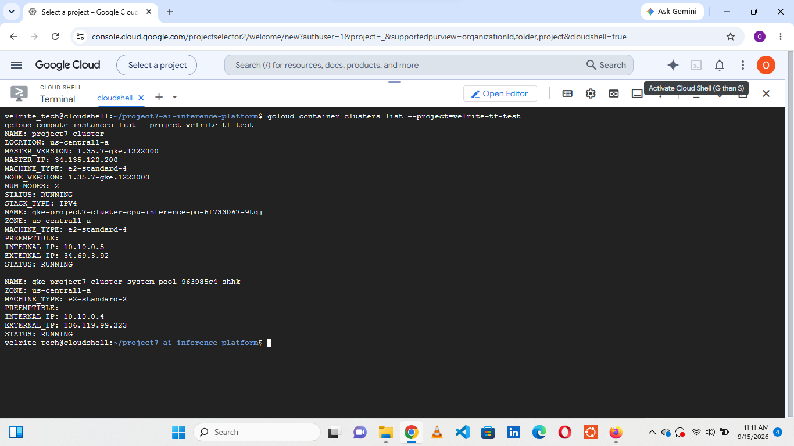](docs/10-evidence/09-zero-cost-teardown.png)

**10-kyverno-signature-enforcement**

[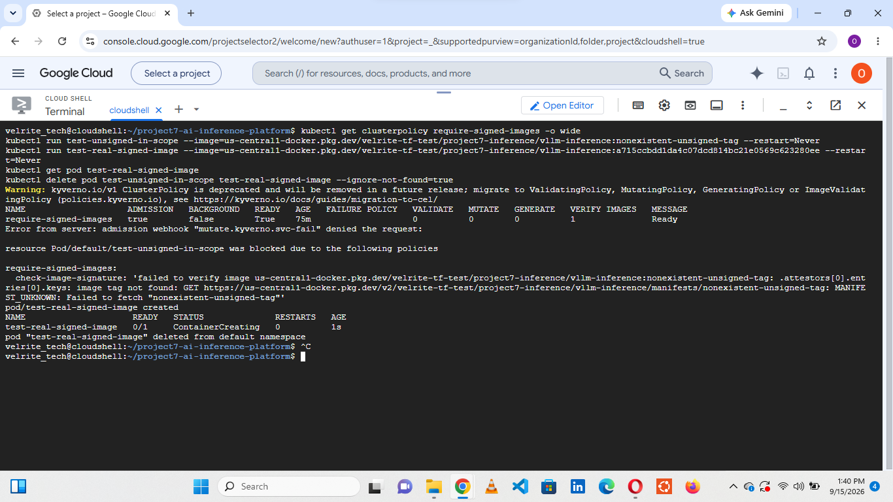](docs/10-evidence/10-kyverno-signature-enforcement.png)

**11-argocd-gitops-sync**

[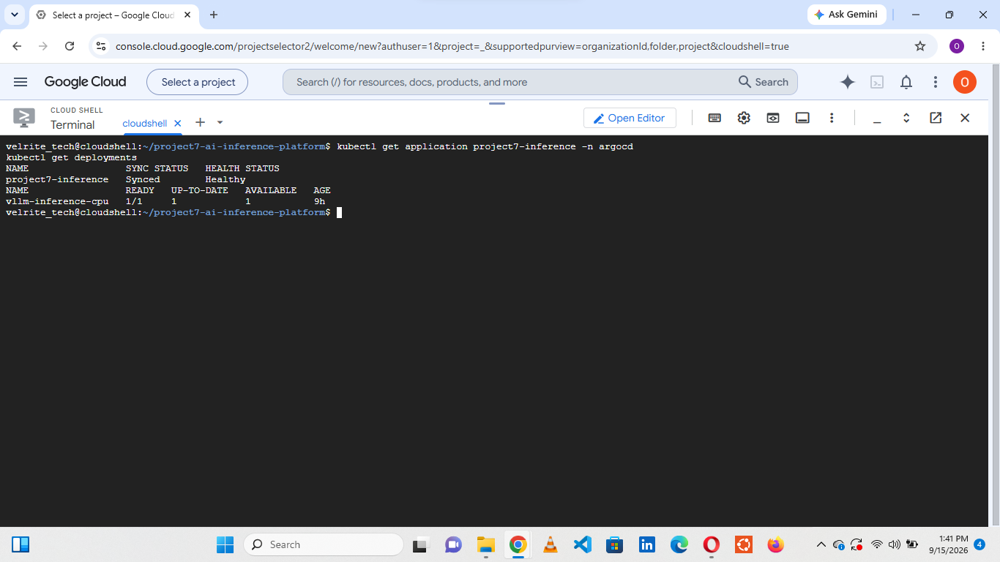](docs/10-evidence/11-argocd-gitops-sync.png)

**12-networkpolicy-enforcement-test**

[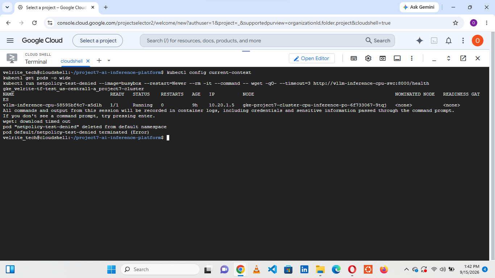](docs/10-evidence/12-networkpolicy-enforcement-test.png)

**13-sbom-artifact**

[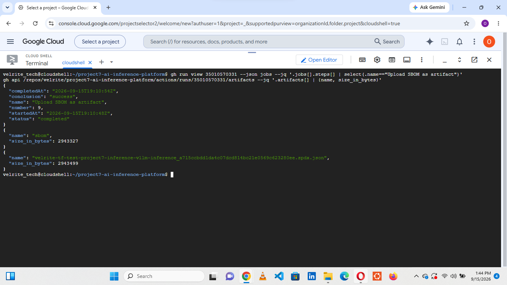](docs/10-evidence/13-sbom-artifact.png)

**14-chain-of-custody**

[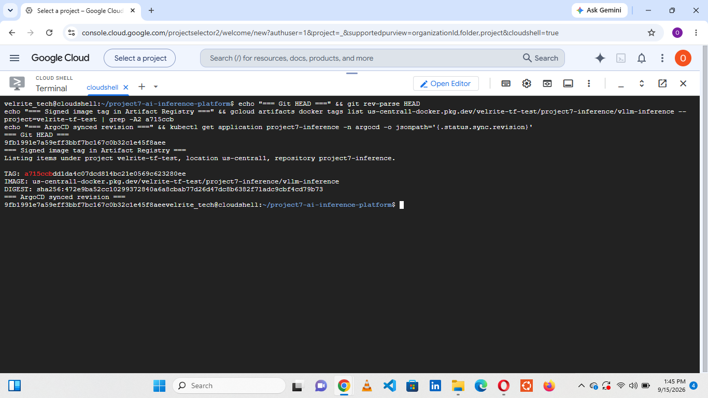](docs/10-evidence/14-chain-of-custody.png)

</details>
