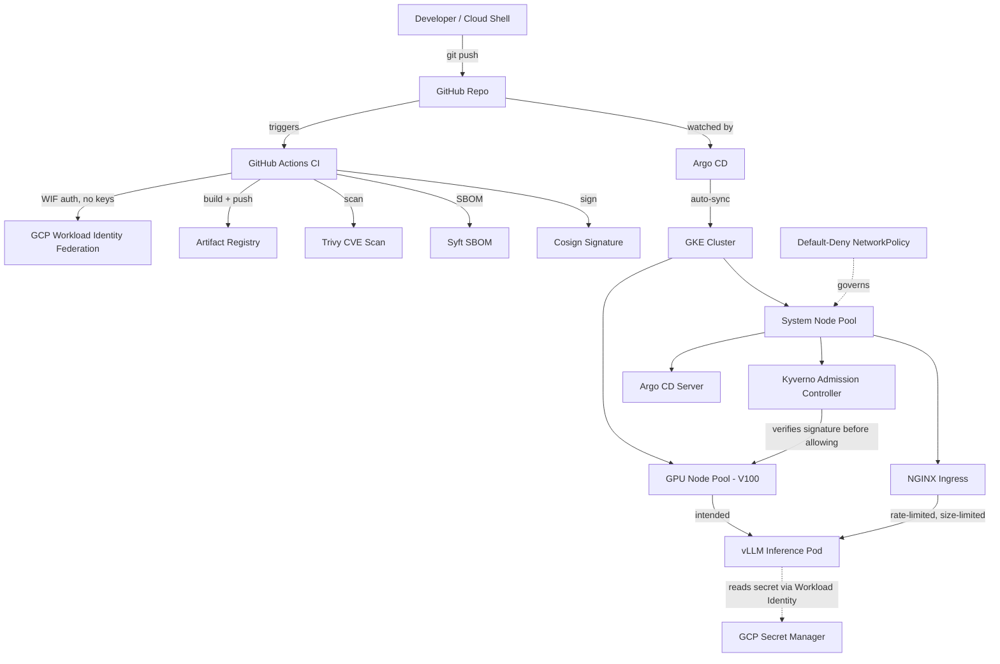

# Architecture

## High-level architecture (verified components only)

## Components and responsibilities

| Component | Responsibility | Status |
|---|---|---|
| GKE cluster (zonal) | Container orchestration | ✅ Verified running |
| System node pool (e2-standard-2) | Hosts platform workloads: Kyverno, Argo CD, NGINX Ingress | ✅ Verified running |
| GPU node pool (V100, n1-standard-4) | Intended host for vLLM inference pod | ✅ Verified created in Terraform; ⛔ node provisioning blocked — see ADR-006 |
| Artifact Registry | Stores built container images | ✅ Verified |
| GitHub Actions CI | Build, scan, SBOM, sign | ✅ Verified — full pipeline green |
| Workload Identity Federation | Keyless GitHub→GCP auth for CI | ✅ Verified — no static credentials anywhere in this project |
| Kyverno | Admission-time signature enforcement | ✅ Verified — live pass/fail test |
| Argo CD | GitOps sync of k8s/ manifests to cluster | ✅ Verified — live auto-prune test |
| NGINX Ingress | Rate limiting, request size limits | ✅ Verified — live burst test, oversized-payload test |
| Secret Manager + Workload Identity | Runtime secret access without JSON keys | ✅ Verified — live bound/unbound test |
| Default-deny NetworkPolicy | Pod-to-pod traffic segmentation | ✅ Verified — live allow/deny test |

## Trust boundaries

- **GitHub → GCP**: crossed only via short-lived OIDC tokens (Workload Identity Federation). No long-lived service-account key exists for CI at any point in this project's history — verified, since GCP's org policy `constraints/iam.disableServiceAccountKeyCreation` was discovered to actively block key creation, which forced this design rather than allowing a shortcut.
- **Registry → Cluster**: crossed only through Kyverno's signature check. An image without a valid Cosign signature cannot become a running pod on this cluster — verified live.
- **Pod → Secret Manager**: crossed only through per-workload Workload Identity bindings, scoped to a single named Kubernetes service account in a single namespace — not a cluster-wide grant.
- **External traffic → Cluster**: crossed only through the NGINX Ingress, which enforces rate and size limits before any request reaches an application pod.

## Failure boundaries

- The system node pool and GPU node pool are separate node pools with a taint on the GPU pool, so a failure or misconfiguration in platform tooling (Kyverno, Argo CD) cannot consume GPU capacity, and vice versa.
- Kyverno's `validationFailureAction: Enforce` means a broken or unreachable signature-verification path fails closed — this was observed directly during debugging, when a permissions gap caused every image (including legitimate ones) to be rejected rather than silently allowed.

## Scaling boundaries

- GPU node pool: `min_node_count: 0`, `max_node_count: 1` — deliberately capped at one node, matching the explicit non-goal of multi-node inference.
- System node pool: `min_node_count: 1`, `max_node_count: 8` — autoscales to absorb platform tooling load (Calico, Kyverno, Argo CD all compete for the same small nodes; this ceiling was raised twice during the build after real `Insufficient cpu`/`Insufficient memory` scheduling failures — see ADR-005).
